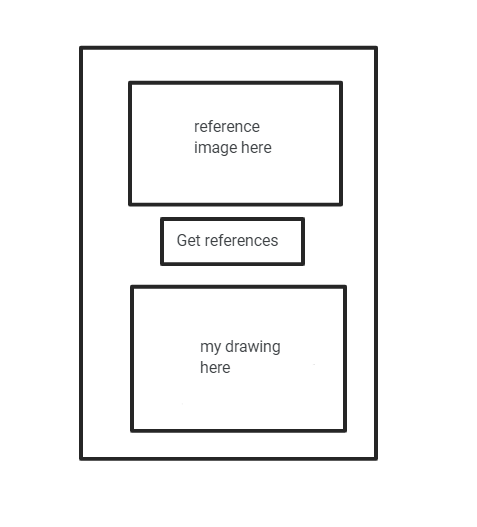
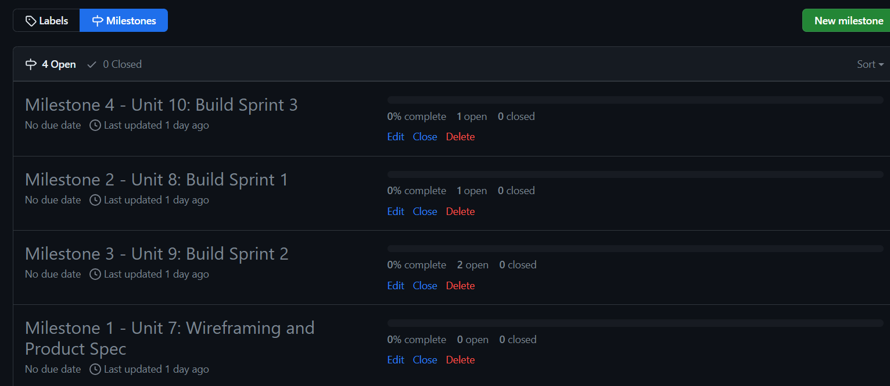
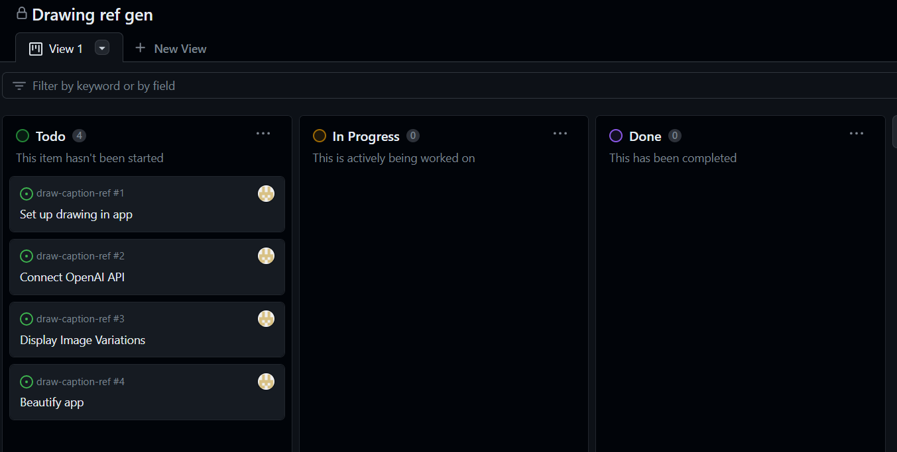
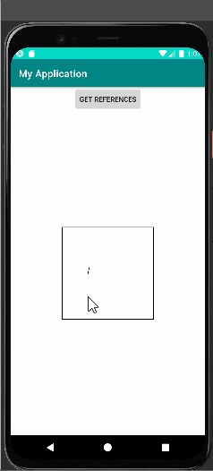
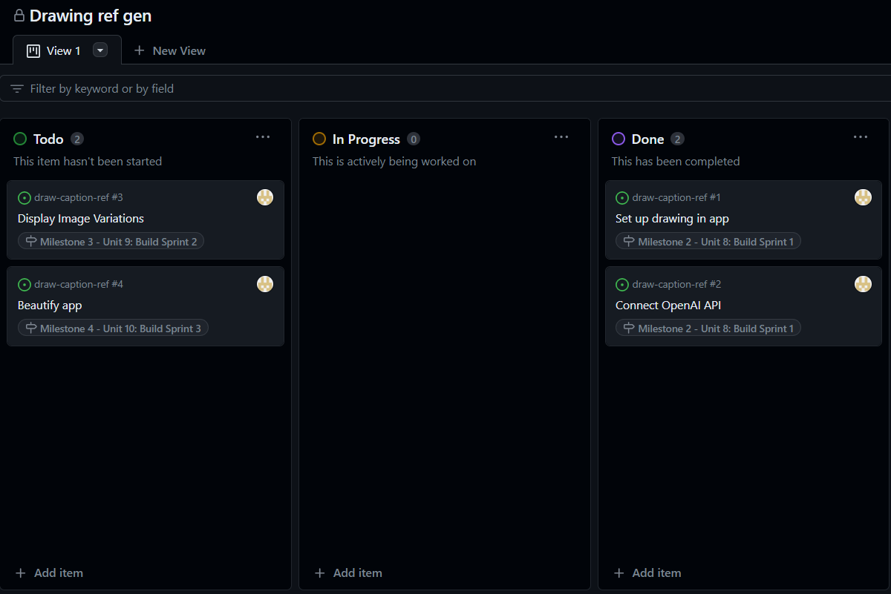
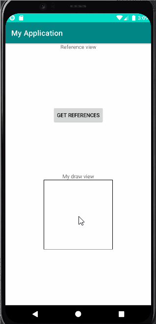

# Milestone 1 - Drawing ref app (Unit 7)

## Table of Contents

1. [Overview](#Overview)
1. [Product Spec](#Product-Spec)
1. [Wireframes](#Wireframes)

## Overview

### Description

A drawing app that supports ai generated variations (using [openAI API](https://openai.com/blog/openai-api)) of your drawing for inspiration.

### App Evaluation

[Evaluation of your app across the following attributes]
- **Category:** Productivity
- **Mobile:** Mobile is essential for the drawing experience as it is convenient for touch screen motions for drawing. 
- **Story:** Creates a drawing aid/support for beginner and long time artists.
- **Market:** Any people interested in drawing with new ideas. 
- **Habit:** Users can notice the impact on their works and continue use of this app.
- **Scope:** V1 allows for a few variations. V2 allows for different medium or style support in drawing pad. V3 allows for caption generation working with image generation to produce more accurate image variations that are similar to what the user is producing.

## Product Spec

### 1. User Features (Required and Optional)

**Required Features**

1. A view that allows for drawing interactions
2. Get image variations through API call
3. Display image variations in Image View

**Optional Features**

1. Allow user to click through multiple image variations

### 2. Screen Archetypes

- Main screen
  - A drawing view
  - get api image variations
  - display image variations

### 3. Navigation

n/a

## Wireframes

 

# Milestone 2 - Build Sprint 1 (Unit 8)

## GitHub Project board

## Issue cards

## Issues worked on this sprint

- Set up drawing in app
- Connect API
- 

 

# Milestone 3 - Build Sprint 2 (Unit 9)

## GitHub Project board

## Completed user stories

- A view that allows for drawing interactions
- Get image variations through API call
- Display image variations in Image View
- Allow user to click through multiple image variations

## License

    Copyright [2023] [Yiyi Huang]

    Licensed under the Apache License, Version 2.0 (the "License");
    you may not use this file except in compliance with the License.
    You may obtain a copy of the License at

        http://www.apache.org/licenses/LICENSE-2.0

    Unless required by applicable law or agreed to in writing, software
    distributed under the License is distributed on an "AS IS" BASIS,
    WITHOUT WARRANTIES OR CONDITIONS OF ANY KIND, either express or implied.
    See the License for the specific language governing permissions and
    limitations under the License.

